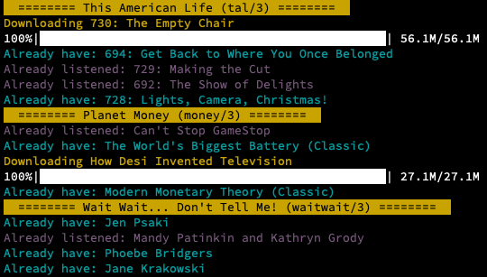

# podpuller

### A simple python app to sync your podcasts with RSS feeds and transfer to an external MP3 player

## Quick Start

1. Copy `feeds.example.conf` to `~/.config/podpuller/feeds.conf`
2. Put in URLs of RSS feeds of podcasts you want. Use a unique section name for each feed. No need to put in a title.
3. In the repo directory: `pip install -r requirements.txt`
4. In the repo directory: `python -m podpuller`

## Motivation

After giving up my smartphone and buying a cheapo MP3 player I wanted a way to keep my feeds synced. 

There are many great programs for this out there, like [Greg](https://github.com/manolomartinez/greg/), but it didn't really fit my workflow, which was having a certain number of the newest episodes of each podcast, and manually marking the ones I have alreaedy listened to. 

This is that app. It was heavily inspired (and liberally copied) from the exellent [upodder](https://github.com/m3nu/upodder) which is no longer maintained. 

## Workflow

1. Choose your RSS feeds
2. Specify how many episodes you want
3. If desired, mark the ones you listened to
4. Sync
5. If desired, transfer to external drive

### Config
The config file is read from `~/.config/podpuller/feeds.conf` and you have an example [here](https://github.com/guyhoffman/podpuller/blob/main/feeds.example.conf). It is pretty straightforward:

##### Global Configs
- `data directory`: Where to store the SQL database of downloaded and listened episodes
- `download directory`: Where to download the podcasts to. 
- `mp3 player directory`: Where to sync the download directory to. 

##### Feed Configs
- Every feed goes into a directory named by its config file section (e.g., `tal` in the sample conf file).
- The `serial` config gets episodes from oldest to newest.
- `start date` ignored everything before that date (useful for `serial` podcasts).
- There's no need to provide a name for the feed, just a URL, the name will be auto-filled from the RSS feed.

### Notes
- Sync both transfers and deletes files. It basically does an exact copy.
- All defaults, including `rsync` flags, are for MacOS but can probably be easily changed for UN*X systems.

## Rant

RSS is a long-standing, open standard for updated feeds. Your podcast success is built on the shoulders of many open-source and open-format developers who poured their heart into it. Please stop making your podcast available only through proprietary channels like Spotify, iTunes, etc. Give back by also publishing your RSS feed. Thanks!

## Roadmap

- Tag MP3 files with info from feed
- ~~UI improvements~~
- ~~Handle "oldest-first" workflow for serial podcasts~~
